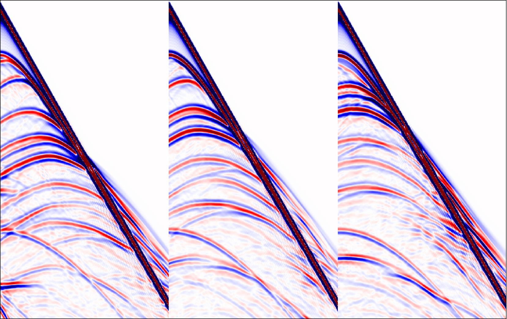
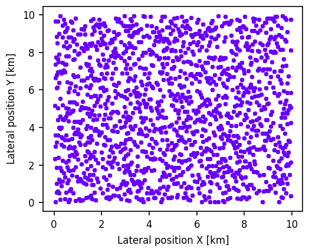
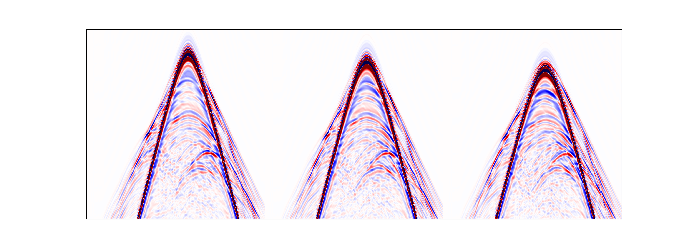
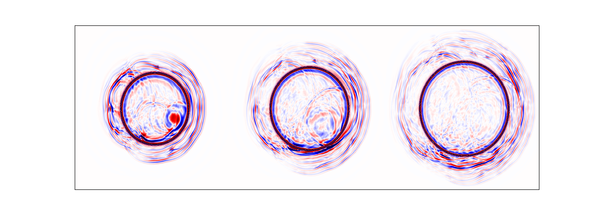

## Contents

- Overview

- Seismic modeling with Devito

- Prerequisites

- Set up:

    - Docker container

    - Upload user files

    - Batch Shipyard configuration

- Submit and monitor a job

- Performance analysis and results

- Clean up

- Next steps


## Overview

Numerical seismic modeling lies at the core of many geoscience applications, such as subsurface imaging or CO2 monitoring, and involves modeling acoustic or elastic wave propagation in the subsurface. This physical process is modeled numerially by solving partial differential equations on large-scale two- and three-dimensional domains using finite-difference time-stepping. Typical seismic surveys, as used for resource exploration in the oil and gas industry, involve modeling seismic data for thousands of individual experiments. Solving wave equations for real-world problem sizes is computationally expensive, but as individual experiments are independent of each other, this process can be executed as an embarassingly parallel workload.

This guide provides a walk through of how to deploy a parallel seismic modeling workload to Azure using [Azure Batch](https://azure.microsoft.com/en-us/services/batch/) and [Batch Shipyard](https://github.com/Azure/batch-shipyard). For discretizing and solving the underlying wave equations the example uses [Devito](https://www.devitoproject.org/), a domain-specific language compiler for finite-differnce modeling. Devito allows implementing wave equations as high-level symbolic Python expressions and  automatically generates and compiles optimized C code during runtime. The Python script provided in the accompanying software models seismic data for a given seismic source location and stores the modeled data in [Blob storage](https://azure.microsoft.com/en-us/services/storage/blobs/). To model seismic data for a large number of individual source experiments, the workload is deployed as a parallel job to a pool of workers using Batch Shipyard, a tool for provisioning and monitoring workloads with Azure Batch. Each task of the batch job corresponds to modeling seismic data for a given seismic source location and can be executed on a single compute node or on a cluster of multiple nodes using message passing (Figure 1). By leveraging the scalabilty of Azure Batch, the modeling workflow can be scaled to thousands of tasks, while automatic scaling enables cost efficient provisioning of computational resources.

The following sections provide a brief overview of seismic modeling with Devito and step-by-step instructions how the bundle the software into a docker container and deploy it as a parallel workload to Azure. This process involves uploading the necessary user data, such as the seismic model and acquisition geometry to Blob storage and setting up the batch environment. This guide demonstrates how to submit and monitor your job and discusses some possible extensions and applications of this software.


#### Figure: {#f1}
{width=50%}
: Parallel batch job for modeling seismic data. Jobs are submitted to a pool using Batch Shipyard and individual tasks either run on separate nodes or as distributed workloads on small clusters. Each task is responsible for modeling the data of a given source location and stores the generated data in Blob storage upon completion.


## Seismic modeling with Devito

Seismic modeling is used in geophysical exploration and monitoring to numerically predict data that is recorded in seismic surveys. Such surveys involve a seismic source being repeateldy fired within the target area, which causes waves to propagate through the subsurface. Where physical properties of the subsurface such as wave speed or density change, waves are reflected and travel back to the surface, where they are recorded by an array of seismic receivers (Figure 2a). The receivers record relative pressure changes in the water as a function of time, sensor number and the source location (Figure 2b). Industry-scale surveys involve thousands of seismic source locations and data has to be modeled for each location individually by numerically solving the corresponding wave equation.

In this workflow, wave equations are discretized and solved with Devito, a Python package for finite-difference modeling and inversion. Devito's application programming interface allows implementing wave equations as symbolic Python expressions that closely resemble the mathematical notation. For example, the acoustic isotropic wave equation with constant density is implemented as:

```
pde = model.m * u.dt2 - u.laplace + model.damp*u.dt
```

where `model.m` is a symbolic expression for the acoustic wave speed, `u` is the discretized acoustic wavefield and `u.dt2` and `u.lapace` are short-hand expressions for finite difference stencils of second temporal and spatial derivatives. The last expression implements absorbing boundaries to mimic wave propagation in an unbounded domain. Similarily, sources and receivers can be symbolically defined as well and added to this expression, making it possible to leverage Devito for real-world applications in exploration seismology. During runtime, Devito automatically generates optimized C code for solving this equation from the symbolic expression, using its internal compiler. Devito's automated performance optimizations include equation clustering, FLOP-reduction optimization, SIMD-vectorization, loop-blocking, as well as the introduction of shared and/or distributed memory parallelism (i.e. multi-threading and domain decomposition).

This tutorial demonstrates how use Azure Batch to model seismic data for a large number of source locations as an embarassingly parallel workload, making it possible to easily scale to relevant problem sizes as encountered in real-world scenarios. The software is deployed to a pool of parallel workers as a Docker container, which contains Devito implementations of the tilted transverse-isotropic (TTI) wave equation. This tutorial covers how to build the required Docker containers from scratch and how to manage the parallel pool and job submissions with Batch Shipyard.


#### Figure: {#f2}
{width=50%}
{width=50%}
: A marine seismic survey, in which a vessel tows a source and generates seismic waves that travel though the subsurface. At geological interfaces, wave are reflected back to the surface, where they are recorded by a set of seismic receivers (a). The receivers record pressure changes in the water as a function of time (vertical axis) and receiver number (horizontal axis) and the experiment is repeated for many source locations (b).


## Experimental set up

The model used in this tutorial is a 3D synthetic TTI model derived from the 3D SEG Salt and Overthrust models, with dimensions of 3.325 x 10 x 10 km. The model consists of six physical parameter, namely P-wave velocity, density, Thomsen parameters epsilon and delta, as well as tilt and azimuth of the anisotropy symmetry axes. The model is discretized with a 12.5 m cartesian grid, which results in 347 x 881 x 881 grid points, including 80 grid points for absorbing boundaries in each dimension. The seismic data is modeled for 2 seconds using a Ricker wavelet with 15 Hertz peak frequency, with data being recorded by 1,500 receivers that are randomly distributed along the ocean floor (Figure 3a). The source vessel fires the seismic source on a dense regular grid, consisting of 799 x 799 source locations (638,401 in total, Figure 3b). For modeling, source-receiver reciprocity is applied, which means that sources and receivers are interchangeable and data can be sorted into 1,500 shot records with 638,401 receivers each, which reduces the number of indivudal PDE solves to 1,500. For the numerical wave propagation, this tutorial provides Devito implementations of the pseudo-acoustic TTI wave equation with an 8th order finite-difference discretization in space and a 2nd order stencil in time.


#### Figure: {#f3}
{width=50%}
{width=50%}
: Randomized receiver grid with 1,500 ocean-bottom nodes (a) and dense source grid with 799 x 799 shot locations (b). For modeling, source-receiver reciprocity is applied, resuling in 1,500 shot location with a dense receiver grid.


## Prerequisites

- Install Azure CLI, Batch Shipyard

- Optional: Batch Explorer

- (Or run everything from George's docker container. Will it be made public?)


## Azure Set up

### Docker container

- Optional: Build Docker containers and upload to Dockerhub

- Alternatively: Use pre-built containers


### Upload user files

- Upload model + geometry

- Upload Python script


### Batch shipyard configuration


1. Choosing the VM type: 

For running seismic modeling and imaging jobs with Azure Batch, the first step is the selection of the virtual machine (VM) type. This choice is determined by whether the defining factor of the job is a quick turn-around-time or keeping the cost low:

 - **Cost**:  If cost is the defining factor for modeling the data set, it makes sense to choose the VM type based on the amount of memory that is required per task (i.e. for modeling data for a single source location), as memory is most defining cost factor. For the example in this tutorial, each wavefield per time step and each model (after padding) require approximately 1 GB of memory. For pseudo-acoustic modeling, we need to be able to store a total of six wavefields in memory at a time, as well as 6 versions of the model (velocity, density, two Thomsen parameters and two tilt angles). Therefore, modeling data for a single source location requires a VM with at least 12 GB of memory, plus ~20% of additional memory for the remaining parameters, such as source-receiver coordinates and seismic data. Forward modeling is generally a compute-intensive rather than a memory intensive workload, so preferable VM types include general purpose and compute-optimized VMs (D and F-series). Seismic imaging on the other hand is a memory-intensive workload, so appropriate VM types include the E, G and M-series.

 - **Turn-around-time/performance**: If the defining factor of the job is not cost, but a quick turn-around time and performance, it makes sense to choose VM types with a larger number of cores, such that a higher level of parallelization can be achieved during forward modeling. This typically results in VMs with more memory than required to run the job and therefore results in a trade-off between cost and turn-around time. For jobs with a priority on a quick turn-around time, appropriate VM types include compute-optimized VMs (D and F-series), as well as HPC-optimized VMs (H-series). In the example in this tutorial, we are interested in performance and therefore choose the `HBv2` VM, which has 120 CPU cores and 480 GB of memory. 


2. Choosing the number of MPI ranks and OpenMP: 

Once a choice is made for a VM type, the next step is to select the number of MPI ranks for each task, as well as the number of OpenMP threads per MPI rank. As a rule of thumb, we want to assign one MPI rank per socket to avoid NUMA effects, and we want to make use of all available cores on the respective VM. In our example, we use a single `HBv2` node per task, which has 30 sockets with 4 cores each. Therefore, we set the number of MPI ranks per task to 30 and the number of OpenMP threads to 4, which results in a total of ``4 \times 30=120`` processes per VM (which is equal to the number of available cores on the `HBv2` node).


3. Choosing a pool size

The size of the parallel pool determines how many tasks can be executed in parallel. As there is no cost difference in running a pool with 100 nodes for 1 hour versus running a pool with 10 nodes for 10 hours, it makes sense to choose the pool size as large as possible in order to obtain the fastest turn-around time. If possible, set the pool size to the number of available tasks or otherwise select the largest pool size that is allowed by the Azure Batch quota.


4. Filling out shipyard configuration files

- How to fill out config files (`credentials.yaml`, `config.yaml`, `pool.yaml`, `jobs.yaml`)


## Submit and monitor a job

- Start small pool: `./shipyard pool add -v` (then resize)

- Submit job: `./shipyard jobs add --tail stdout.txt -v`

- Check `stderr.txt` for Devito output

- Connect to compute nodes and run `top`

- Monitor CPU usage + memory in Batch Explorer


## Performance analysis and results

- Show scalability

- Plot performance, FLOPs

- Download + plot seismic data

#### Figure: {#f4}
{width=100%} \
{width=100%}
: Crossline samples of a 3D modeled seismic shot record (a) and time slices at increasing recording times (b).


## Clean up

 - Kill job: `./shipyard jobs del -v`

 - Shut down pool: `./shipyard pool del -v`


## Next steps

Numerical seismic modeling functions as a key ingredient to a broad variety of applications, including subsurface imaging, parameter estimation or monitoring of geohazards. As such, the seismic modeling workflow demonstrated in this tutorial can function as a building block for more sophisticated workflows, which rely on forward modeling as the underlying workhorse. For example, instead of forward propagating a seismic source to model seismic data, recorded data from a seismic survey can be backpropagated in time by solving an adjoint wave equation, which results in a seismic image of the subsurface. An example of seismic imaging using a combination of Azure Batch and Azure Functions can be found [here](https://arxiv.org/abs/1911.12447). Furthermore, the forward modeling module from this tutorial can function as a building block for iterative workflows, such as full-waveform inversion or least-squares imaging.

