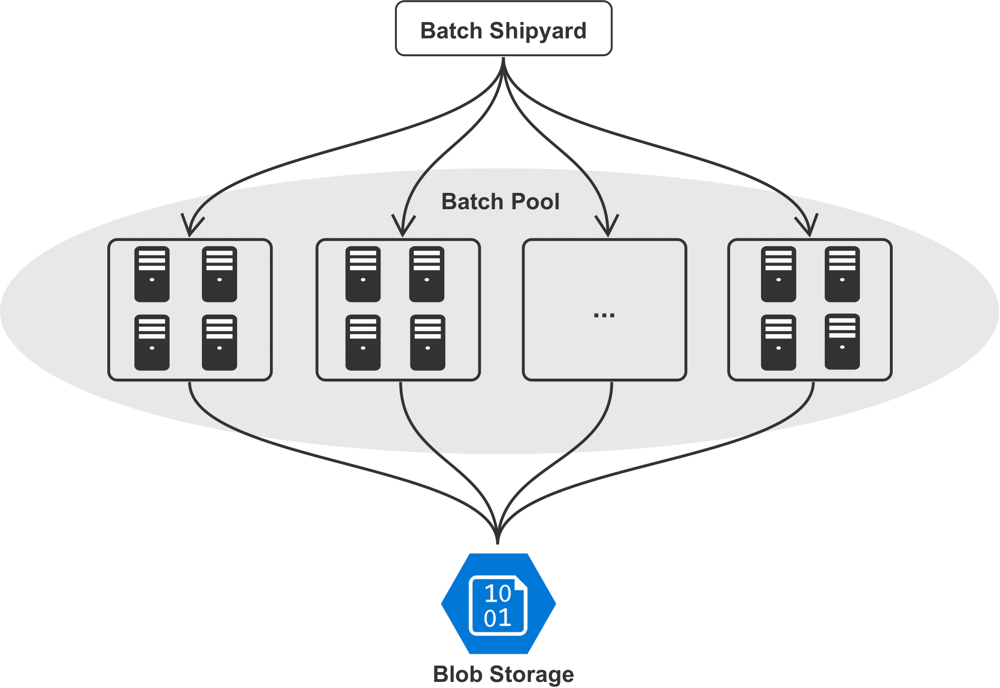

## Contents

- Overview

- Seismic modeling with Devito

- Prerequisites

- Set up:

    - Docker container

    - Upload user files

    - Batch Shipyard configuration

- Submit and monitor a job

- Review results

- Clean up

- Next steps

## Overview

Numerical seismic modeling lies at the core of many geoscience applications, such as subsurface imaging or CO2 monitoring, and involves modeling acoustic or elastic wave propagation in the subsurface. This physical process is modeled numerially by solving partial differential equations on large-scale two- and three-dimensional domains using finite-difference time-stepping. Typical seismic surveys, as used for resource exploration in the oil and gas industry, involve modeling seismic data for thousands of individual experiments. Solving wave equations for real-world problem sizes is computationally expensive, but as individual experiments are independent of each other, this process can be executed as an embarassingly parallel workload.

This guide provides a walk through of how to deploy a parallel seismic modeling workload to Azure using [Azure Batch](https://azure.microsoft.com/en-us/services/batch/) and [Batch Shipyard](https://github.com/Azure/batch-shipyard). For discretizing and solving the underlying wave equations the example uses [Devito](https://www.devitoproject.org/), a domain-specific language compiler for finite-differnce modeling. Devito allows implementing wave equations as high-level symbolic Python expressions and  automatically generates and compiles optimized C code during runtime. The Python script provided in the accompanying software models seismic data for a given seismic source location and stores the modeled data in [Blob storage](https://azure.microsoft.com/en-us/services/storage/blobs/). To model seismic data for a large number of individual source experiments, the workload is deployed as a parallel job to a pool of workers using Batch Shipyard, a tool for provisioning and monitoring workloads with Azure Batch. Each task of the batch job corresponds to modeling seismic data for a given seismic source location and can be executed on a single compute node or on a cluster of multiple nodes using message passing (Figure 1).

The following sections provide a brief overview of seismic modeling with Devito and step-by-step instructions how the bundle the software into a docker container and deploy it as a parallel workload to Azure. This process involves uploading the necessary user data, such as the seismic model and acquisition geometry, to Blob storage and setting up the batch environment. This guide then demonstrates how to submit and monitor your job and discusses some possible extensions and applications of this software.

#### Figure: {#f1}
{width=50%}
: Parallel batch job for modeling seismic data. Jobs are submitted to a pool using Batch Shipyard and individual tasks run on separate nodes, or as distributed workloads on small clusters. Each task is responsible for modeling the data of a given source location and stores the generated data in Blob storage upon completion.

## Seismic modeling with Devito

Using devito.

## Prerequisites

- Install Azure CLI, Batch Shipyard

- Optional: Batch Explorer

- (Or run everything from George's docker container. Will it be made public?)

## Set up

### Docker container

- Optional: Build Docker containers and upload to Dockerhub

- Alternatively: Use pre-built containers

### Upload user files

- Upload model + geometry

- Upload Python script

### Batch shipyard configuration

- Fill out config files (`credentials.yaml`, `config.yaml`, `pool.yaml`, `jobs.yaml`)

## Submit and monitor a job

- Start small pool: `./shipyard pool add -v` (then resize)

- Submit job: `./shipyard jobs add --tail stdout.txt -v`

- Check `stderr.txt` for Devito output

- Connect to compute nodes and run `top`

- Monitor CPU usage + memory in Batch Explorer

## Review results

- Download + plot data

## Clean up

 - Kill job: `./shipyard jobs del -v`

 - Shut down pool: `./shipyard pool del -v`

## Next steps

Numerical seismic modeling functions as a key ingredient to a broad variety of applications, including subsurface imaging, parameter estimation or monitoring of geohazards. As such, the seismic modeling workflow demonstrated in this tutorial can function as a building block for more sophisticated workflows, which rely on forward modeling as the underlying workhorse. For example, instead of forward propagating a seismic source to model seismic data, recorded data from a seismic survey can be backpropagated in time by solving an adjoint wave equation, which results in a seismic image of the subsurface. An example of seismic imaging using a combination of Azure Batch and Azure Functions can be found [here](https://arxiv.org/abs/1911.12447). Furthermore, the forward modeling module from this tutorial can function as a building block for iterative workflows, such as full-waveform inversion or least-squares imaging.

